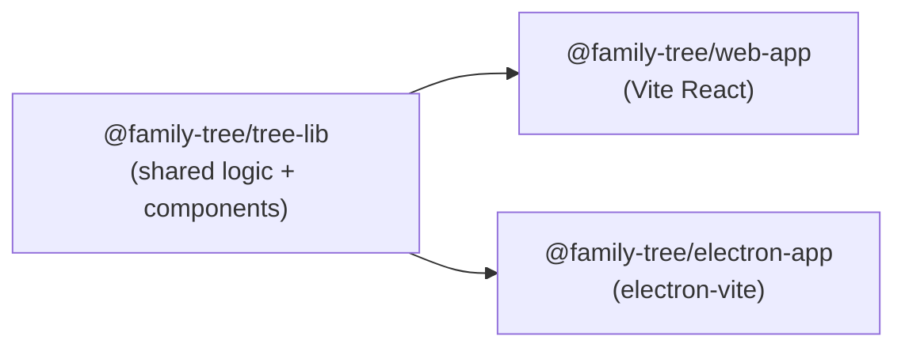
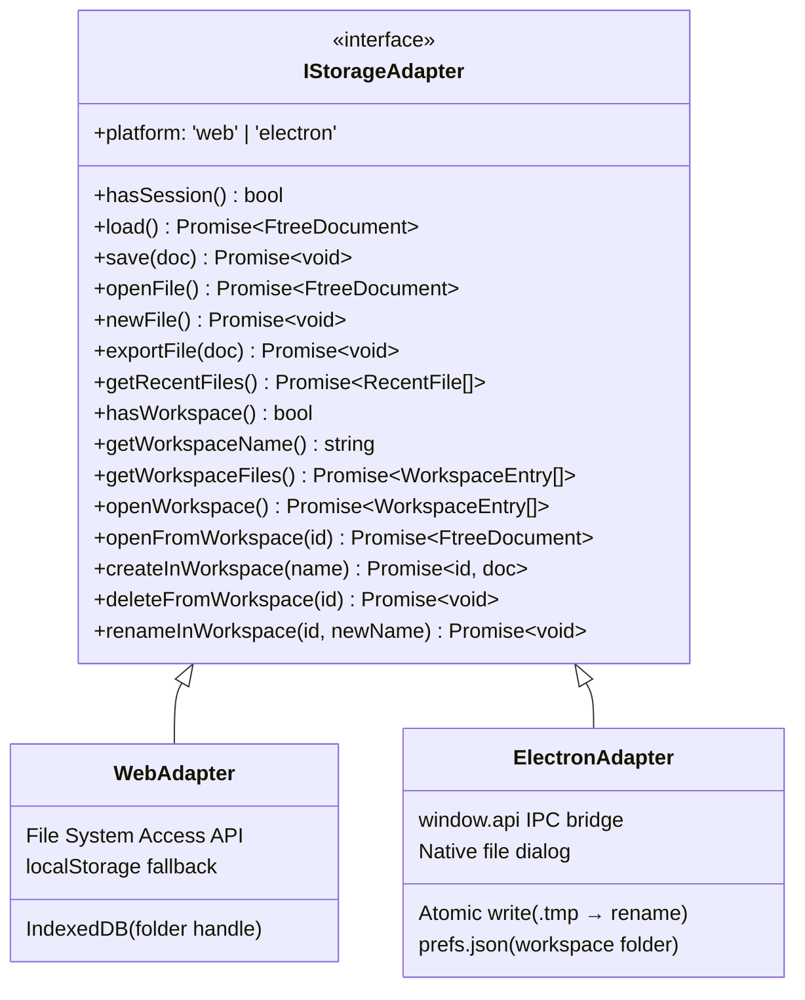
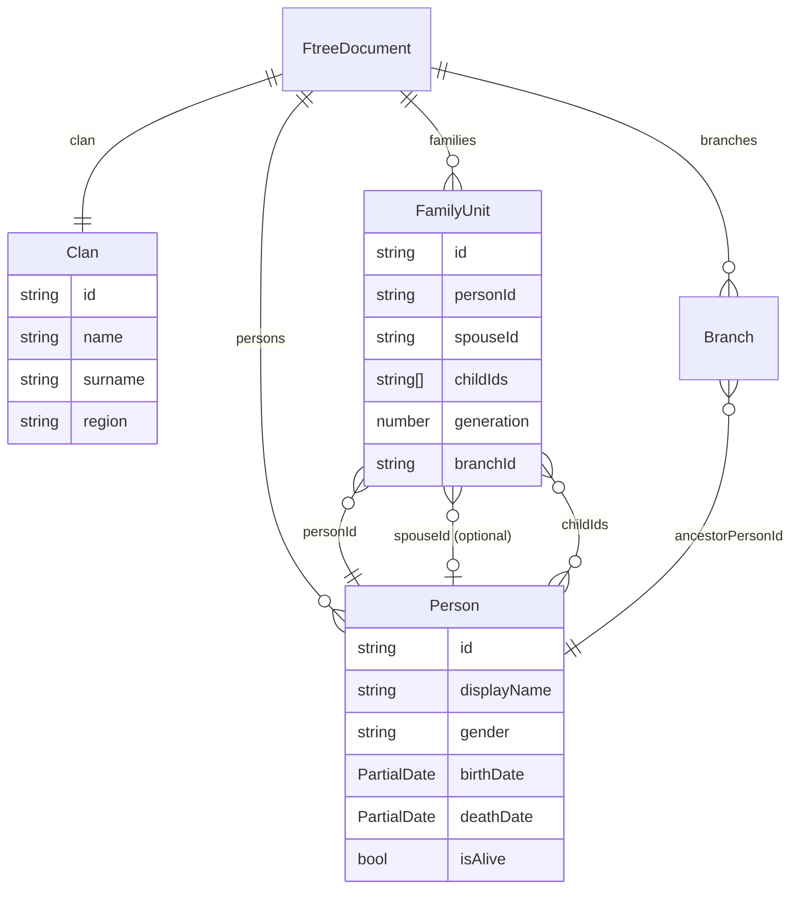
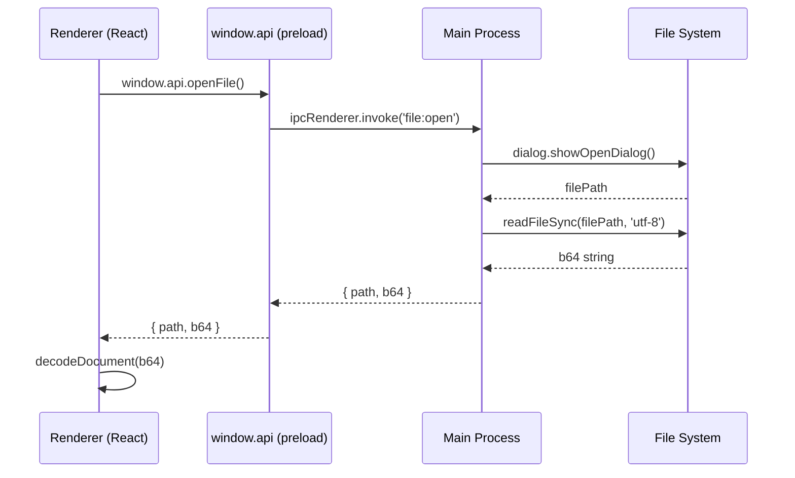
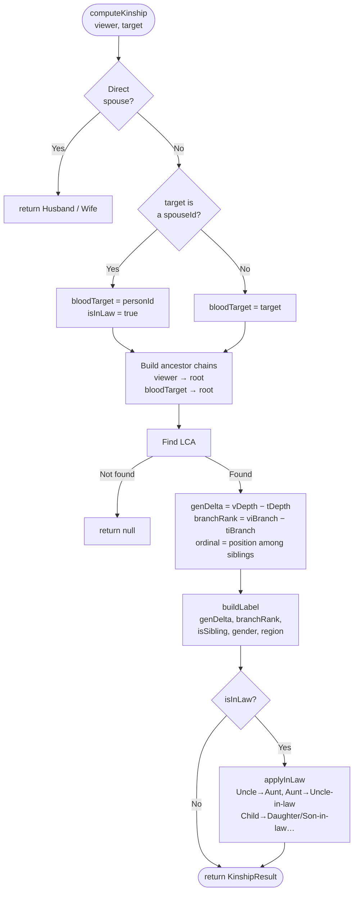
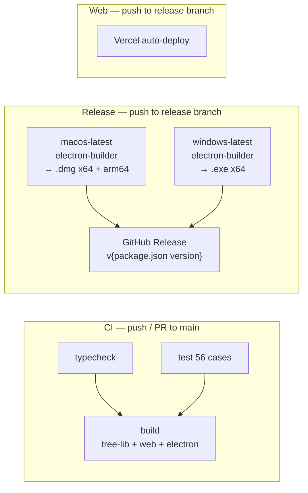

# Family Tree

Vietnamese family tree manager — runs in the browser and as a desktop app (Electron).  
Data is stored as `.ftree` files (base64 JSON), fully **local-first**, no account required.  
Available on **Web** (Vercel) and **Desktop** (Windows / macOS).

[](https://github.com/nguyen-tri-nhan/family-tree/actions/workflows/ci.yml)

---

## Features

- Multi-generation, multi-branch family trees
- Automatic kinship labeling (dialect-aware for Northern/Southern Vietnamese)
- Lunar and solar calendar support
- Export to PNG / PDF
- URL sharing — encode entire tree into a shareable link (read-only)
- Folder workspace — manage multiple `.ftree` files in a local folder (Web FSA / Electron native)
- Drag & drop `.ftree` files into the app to import into the active workspace
- Kinship quiz — interactive game to learn family relationships
- Web app + Desktop app (Windows/macOS) sharing the same codebase

---

## Monorepo

```
family-tree/
├── Makefile
├── frontend/                        npm workspaces + Lerna
│   ├── packages/
│   │   ├── tree-lib/                @family-tree/tree-lib
│   │   ├── web-app/                 @family-tree/web-app
│   │   └── electron-app/            @family-tree/electron-app
│   └── package.json
├── sample/                          Sample .ftree files
└── specs/                           Design documents
```



---

## Architecture

### Storage Adapter Pattern

Both web and desktop share the same `App.tsx` from `tree-lib`. The only difference is the **adapter** — injected via React Context.



| Action | WebAdapter | ElectronAdapter |
|---|---|---|
| Open file | `<input type="file">` | `dialog.showOpenDialog` |
| Save (single) | `localStorage` + download | `writeFileSync` atomic |
| Workspace | File System Access API + IndexedDB | Native folder dialog + `prefs.json` |
| Recent files | Not supported | `prefs.json` in userData |

---

### Data Model — FtreeDocument

A `.ftree` file is `base64(encodeURIComponent(JSON.stringify(FtreeDocument)))`.



`region: 'north' | 'south'` on Clan controls kinship terminology (Bố/Mẹ vs Ba/Má, ordinals Cả/Hai…).

---

### Electron IPC Flow

The main process does not expose Node.js to the renderer — all file operations go through IPC.



Preload is built as **CJS** (`index.cjs`) — Electron's sandbox does not support ESM `import` in preload scripts.  
Main process is built as **ESM** (`index.js`) with `"type": "module"`.

---

### Kinship Algorithm

Uses **Lowest Common Ancestor (LCA)** on the family tree graph.



- `genDelta > 0` — target is an older generation (Grandfather, Father…)
- `branchRank > 0` — viewer's branch is junior → target is senior (Elder uncle, Elder brother…)
- `branchRank < 0` — viewer's branch is senior → target is junior (Younger uncle, Younger sibling…)

---

## CI/CD



| Workflow | Trigger | Output |
|---|---|---|
| `ci.yml` | push / PR → `main` | typecheck + test + build |
| `release.yml` | push → `release` | `.dmg` + `.exe` → GitHub Release |
| Vercel | push → `release` | Deploy `<project>.vercel.app` |

`node_modules` is cached per `runner.os × hash(package-lock.json)` — `npm ci` only runs on cache miss.

---

## Getting Started

```bash
make install        # npm ci

make dev-web        # localhost:5173
make dev-electron   # Electron window

make test           # 56 unit tests (vitest)
make typecheck      # TypeScript check all packages

make build          # Build everything (tree-lib → web + electron)
```

---

## Releasing

1. Bump `version` in `frontend/packages/electron-app/package.json`
2. Merge into the `release` branch
3. GitHub Actions builds and publishes release `v{version}` automatically

---

## File Format `.ftree`

```
encode: base64( encodeURIComponent( JSON.stringify(FtreeDocument) ) )
decode: JSON.parse( decodeURIComponent( atob(b64) ) )
```

Full UTF-8/Unicode support. Files can be opened in any text editor for debugging.

---

## Specs

| File | Description |
|---|---|
| [specs/data.md](specs/data.md) | Detailed data model + .ftree schema |
| [specs/render.md](specs/render.md) | Render strategy by node count |
| [specs/storage.md](specs/storage.md) | Storage adapter pattern + file operations |
| [specs/workspace.md](specs/workspace.md) | Multi-file folder workspace |
| [specs/kinship-vietnam.md](specs/kinship-vietnam.md) | Vietnamese kinship terminology |
| [specs/quiz.md](specs/quiz.md) | Kinship quiz feature |
| [specs/usecase.md](specs/usecase.md) | Use case documentation |
| [specs/backlog.md](specs/backlog.md) | Feature backlog |
