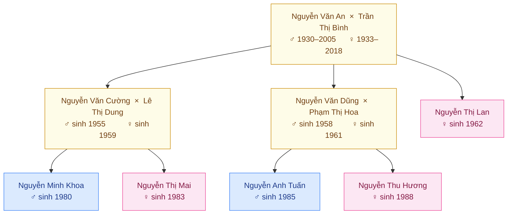

# Demo — Cây Gia Phả 3 Thế Hệ

## Hướng phát triển thực tế

Mermaid không vẽ được đúng kiểu T-connection như cây gia phả truyền thống.
Khi vào phần UI thật, nên dùng thư viện chuyên biệt:

| Thư viện | Ưu điểm |
|----------|---------|
| [`relatives-tree`](https://github.com/nicktindall/relatives-tree) | Layout chuẩn phả hệ, hỗ trợ nhiều quan hệ |
| [`family-chart`](https://github.com/nicktindall/relatives-tree) | Render SVG đẹp, interactive |
| D3.js `tree` layout | Tùy biến cao, cần code nhiều hơn |
